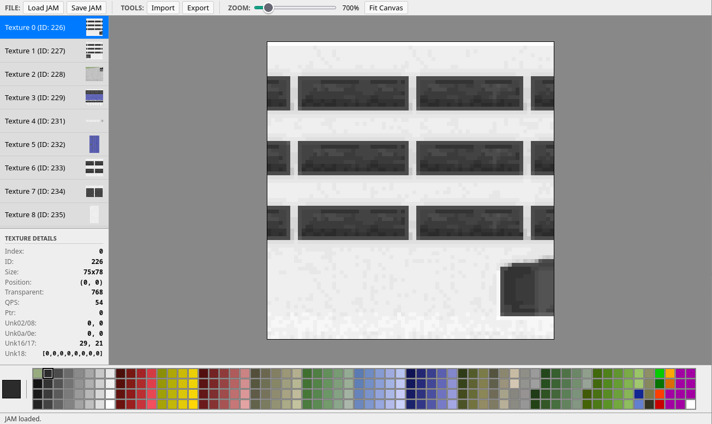

# jamtool

`jamtool` is a Rust-based library and command-line utility for manipulating `.JAM` texture files, used by the game 
*Grand Prix 2*. It also includes an interactive WebAssembly-based web editor for editing textures pixel-by-pixel.

> **Disclaimer**: this is not the classic early 2000 hero-level take on reverse engineering that made *Grand Prix 2* a legend, 
> but my mid-2026 personal excuse to learn Rust with help from generative AI on something I've never dared to do before.
> Because of [renewed](https://grandprix2.racing/file/misc/view/x86gp2) [interest](https://store.steampowered.com/app/3603720/GCR2_Geoff_Crammond/), I hope this can be useful to someone :).



Try it out at [jamtool.playlinux.net](https://jamtool.playlinux.net)!

## Installation

### Prerequisites

- [Rust](https://www.rust-lang.org/tools/install) (latest stable)
- [wasm-pack](https://rustwasm.github.io/wasm-pack/installer/) (for building the web editor)

### Building the CLI

```bash
cargo build --release
```

The binary will be available at `target/release/jamtool`.

### Building the Web Editor

```bash
wasm-pack build --target web
```

This will generate the WASM and JavaScript glue code in the `pkg/` directory.

## Usage

### CLI

#### Decode (extract JAM to PNG + metadata)

```bash
./target/release/jamtool <INPUT.JAM> <OUTPUT_DIR>
```

Extracts all textures into `<OUTPUT_DIR>` as indexed PNGs (one per texture, using GP2 palette colors) along with a `<stem>.json` metadata file. The metadata file stores the original texture headers and palette data needed for re-encoding.

#### Encode (import from PNG + metadata)

```bash
./target/release/jamtool --encode <META_JSON> <OUTPUT.JAM>
```

Reads the metadata JSON and the referenced PNG files from the same directory, then encodes them back into a single encrypted `.JAM` file.

The PNG pixel data must use **local palette indices** (0..quarter_palette_size-1) matching the embedded palette in the metadata. The tool converts these to global GP2 indices and repalettizes internally.

### Web Editor Features

- **Pixel painting** — select any GP2 palette color and draw on textures click-by-click or drag
- **Zoom & pan** — slider, CTRL + scroll wheel, and fit-to-canvas for precise editing
- **Paste images from clipboard** — paste any image, position it by dragging, resize freely with corner handles, and commit with Enter — preview is quantized to GP2 colors in real time
- **Load & save .JAM** — open existing files and save modified ones
- **Import/Export ZIP** — roundtrip to indexed PNGs with metadata for external editing
- **Texture browser** — sidebar with thumbnails and detail panel showing all header fields
- **Pixel inspector** — hover any pixel to see its global palette index and RGB color

### Running Locally

1. Build the WASM package (see above).
2. Serve the project root using a web server (browsers block WASM via `file://`):

**Python:**

```bash
python3 -m http.server
```

**Node.js:**

```bash
npx serve .
```

3. Open `http://localhost:8000` (or the provided port) in your browser.

## References

I'm doing nothing new here, none of this would have been possible without the following resources:

- [JAM Structure](https://www.grandprix2.de/Anleitung/tutus/Jam%20Structure/Jam%20Structure.html) — original format documentation
- [GP2JAM Source Code](https://github.com/tkellaway/gp2-utils/tree/master/GP2JAM) — Trevor Kellaway's reference implementation

See [JAM.md](JAM.md) for a complete reference of the JAM file format as implemented by this project.

## License

This project is licensed under the MIT License - see the [LICENSE](LICENSE) file for details.

